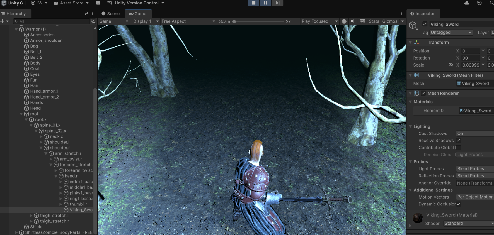

# MISTWALKER: A Saga of the Fog

> *A fallen viking wakes in Niflheim, the world of mist. The dead walk the frozen
> forest, and the only road to Valhalla is paved with the draugr you put back in
> the ground. Carry your blade. Hold your lantern. Do not stop walking.*

**Mistwalker** is a third‑person survival‑horror reimagining built in Unity. It
centers on a sword-wielding warrior (a sword‑wielding warrior in a dead
forest stalked by the undead) but reframes it as an atmospheric Norse‑underworld
journey rather than a generic zombie arena.



---

## The Idea

You are **Aldric the Oathbroken**: a warrior who died without honor and was denied
the halls of the slain. Niflheim is an endless, fog‑shrouded forest. The mist is
alive: it hides the **draugr** (restless Norse dead) and it *remembers* where you
have been. Banish enough draugr and the fog thins, revealing the next stretch of
the road toward the bridge to Valhalla.

The pillars of the design:

| Pillar | What it means in‑game |
| --- | --- |
| **The Fog Remembers** | A fog‑of‑war system reveals terrain as you explore and re‑darkens areas you abandon: backtracking is never "safe." |
| **Honor, not Score** | Every draugr banished restores a sliver of honor. Honor is the run currency, the health economy, and the win condition all at once. |
| **One Good Blade** | No loadouts. A single runic sword. Mastery comes from spacing and timing, not gear. |
| **The Walk** | There is no map screen. Progress *is* forward motion through the mist. |

> Mistwalker is the creative direction layered on top of the scene and systems.

---

## Core Loop

1. **Walk** into the fog. Terrain and threats reveal as you advance.
2. **Fight** the draugr that emerge: read the wind‑up, close the gap, strike.
3. **Banish** them to restore honor and thin the surrounding mist.
4. **Survive** long enough to reach the next clearing; repeat, deeper and darker.

---

## Features (current + planned)

- ⚔️ **Melee combat**: a single Viking sword bound to the warrior's hand bone, with
  hit detection driven by the `PlayerController` attack logic.
- 🌫️ **Dynamic fog of war**: `FogWar` reveals/conceals the world around the player.
- 🧟 **Roaming undead**: `Enemy`‑driven draugr (built on the project's existing
  zombie actors) that hunt the player through the trees.
- 🎥 **Cinemachine camera**: a follow‑cam (`CM vcam1`) framing the walk.
- ❤️ **Health / honor UI**: `HealthBarManager` and `ScoreManager` track survival.
- 🌲 **Hand‑built forest terrain**: multiple stitched terrain tiles form the misted woods.

> *Planned:* lantern light radius, draugr "banish" finisher, fog‑thinning progression
> gate, ambient Norse score.

---

## Controls

| Action | Input |
| --- | --- |
| Move | WASD / Left Stick |
| Look / Aim camera | Mouse / Right Stick |
| Attack | Left Mouse / Right Trigger |
| (Planned) Raise lantern | Right Mouse / Left Trigger |

> Input is handled through Unity's **Input System** package.

---

## Tech Stack

- **Engine:** Unity **6000.2.12f1** (project originally authored in 2022.1, auto‑upgraded)
- **Render pipeline:** Built‑In
- **Camera:** Cinemachine
- **Input:** Unity Input System
- **Language:** C#

---

## Getting Started

1. Install **Unity 6 (6000.2.x)** via Unity Hub.
2. Clone / open this folder as a Unity project.
3. Open the main scene: `Assets/Scenes/SampleScene.unity`.
4. Press **Play**
   
---

## Project Structure

```
Assets/
├─ Scenes/
│  └─ SampleScene.unity        # main playable scene (the misted forest)
├─ Scripts/
│  ├─ PlayerController.cs       # movement, attack, weapon hit detection
│  ├─ Enemy.cs                  # draugr behaviour
│  ├─ ScoreManager.cs           # honor / score tracking
│  └─ ...
├─ Editor/
│  └─ SwordAttacher.cs          # dev tooling: see below
├─ Medieval Viking Sword/       # the runic blade asset (Built‑In / URP / HDRP variants)
└─ ...
```

---

## Dev Tooling: `Tools` menu

`Assets/Editor/SwordAttacher.cs` adds a **Tools** menu in the Unity Editor for
fitting the sword to the warrior's rig. It exists because the playable warrior
(`Warrior (1)`) is rigged at **100× scale** with bones named `hand.r`, while a
*disabled* duplicate (`Warrior`) carries the legacy `Warrior_RightHand` skeleton : 
so weapons have to be parented and scaled carefully.

Most‑used commands:

- **Attach To Active Hand**: instantiates / re‑parents the sword onto the *active*
  `hand.r` bone so it actually renders and animates.
- **Normalize Sword Scale**: counters the 100× bone scale so the blade is ~0.8 m.
- **Sword Local Rot +X90 / +Y90 / +Z90**: nudge the blade's orientation in 90° steps.
- **Map Warriors / List Warrior1 Hand Bones**: diagnostics for the dual‑skeleton setup.

> This tooling is for development convenience and can be removed from a shipping build.

---

## Roadmap

- [ ] Lantern light + darkness pressure
- [ ] Draugr banish finisher and banish VFX
- [ ] Fog‑thinning progression gate between clearings
- [ ] Honor‑as‑health economy
- [ ] Ambient Norse soundscape
- [ ] Boss: the **Warden of the Bridge**

---

## Lessons Learned

Building this taught a lot of core Unity the hard way: prefabs, bone parenting,
local vs world space, active‑state inheritance, import scale, and editor scripting.
The full write‑up lives in **[LEARNING.md](LEARNING.md)**.

---

## Credits

- **Sword:** *Medieval Viking Sword* asset pack (3D Props / Weapons).
- **Engine & systems:** Unity, Cinemachine, Input System.
- Built as a Unity prototype for *Mistwalker*.

---

*Skál. Walk on.*
